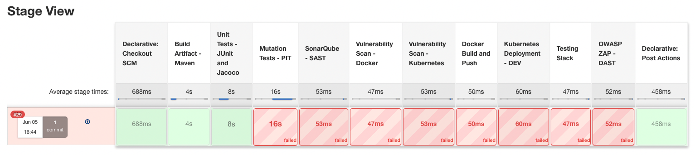

# Hands On DevSecops

## Tools Used:
- Azure VM
- Jacoco
- Docker
- K8
- Kube bench
- ISTIO
- Prometheus
- Falco
- KubeScan
- Sonar
- slack
- Jenkins
- Dependency Check
- OPA Confest
- ZAP
- Grafana

## Vulnerabilities Scanning
 - CIS BenchMark
 - NVD -  National Vulnerabilities Databse
 - CVE - Common Vulnerabilities Exposure
 - CVSS - Common Vulnerabilities Scoring System
 - CWE - Common Weakness Enumeration
 

 
Learning from Course: 
https://www.udemy.com/course/kubernetes-devsecops/learn/lecture/27362268#overview